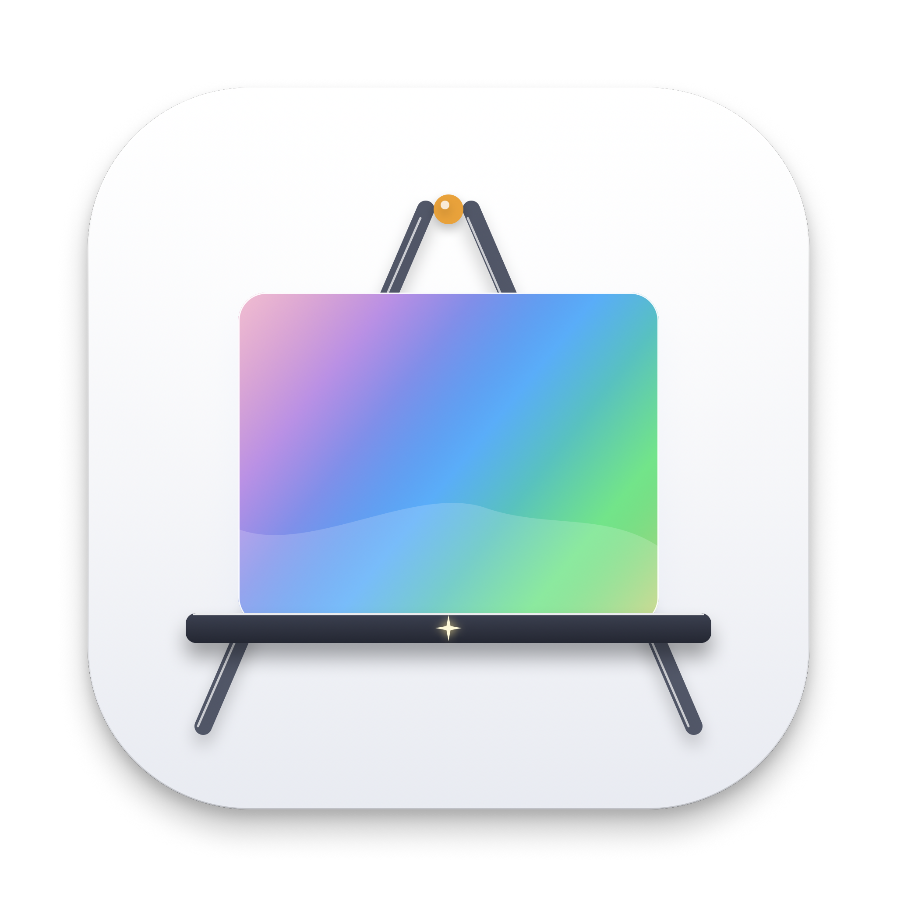
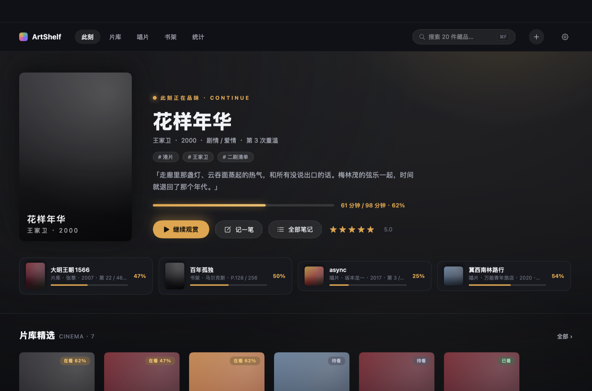

# ArtShelf

<p align="center">
  
</p>

<p align="center">
  <strong>macOS 原生个人媒体策展空间 —— 影视 · 音乐 · 书籍</strong><br>
  一间属于你的沉浸暗房：封面是主角，此刻正在品味的作品永远站在舞台中央。
</p>

<p align="center">
  
  
  
  
  
</p>

---

## 界面预览

<p align="center">
  
</p>

## 核心特性

### 此刻优先的沉浸暗房

- **此刻主页**：最近正在品味的作品以大封面 Hero 呈现——标题、手记摘要、进度、「继续观赏」一键直达；其余进行中的藏品排成队列卡紧随其后
- **封面即主角**：封面满幅铺陈，主色溢出为环境光晕，整个界面从藏品中生长出来
- **外观主题**：暗房（本色深空）、白昼放映厅（暖纸调）或跟随系统在白昼 / 暗房间自动切换，搭配统一沉稳的琥珀色强调
- **图标随心换**：设置内提供象牙画廊与晴空微晶两款精美应用图标，即点即换且随时切回

### 片库 · 唱片 · 书架

- 三个全量网格页：影视与书籍 2:3 竖版、音乐 1:1 方形封面墙，状态徽标叠于封面角落
- 封面右键就地维护：标记已看 / 再看一遍 / 记一笔 / 删除，不必进详情页
- 筛选与排序收进标题行；检索统一走顶栏全局搜索（`⌘F`，跨标题 / 创作者 / 标签 / 笔记）

### 有分寸的进度与记录

- **进度单位贴合内容**：电影按分钟，剧集 / 综艺可按集或期，书籍按页、音乐按音轨
- **策展手记条目化**：每件藏品多条手记，按时间倒序，是品味的回响而非备注栏
- **观看链接与资料链接分离**：豆瓣 / 维基资料页搜索时自动带上、只读查阅；在线观看链接由你手动粘贴，详情页一键唤起
- 0–5 星评分、多标签归档、「再看一遍」自动累计重温次数

### 元数据自动补全（零 API Key）

- 影视：豆瓣联想源为主（华语覆盖最好、标准海报、剧集集数），Wikipedia 摘要 + Wikidata 补导演 / 类型，TVMaze 补英美剧
- 音乐：iTunes Search API（高保真专辑封面、Apple Music 链接）
- 书籍：豆瓣图书 + Google Books；本地 `.epub` 拖入即可精准提取内嵌封面
- 多源结果按标题合并补缺，全部基于公开免费接口

### 数据透明

- 全部数据存于本地 `~/Library/Application Support/ArtShelf/library.json`（规范 JSON，可直接查看）
- 设置面板支持导出 / 导入 JSON 备份；v2 老用户数据首次启动自动无损迁移（先备份，绝不覆盖）
- 零云端、无遥测、零第三方依赖

## 快捷键

| 快捷键 | 功能 |
| :-- | :-- |
| `⌘1` – `⌘5` | 切换 此刻 / 片库 / 唱片 / 书架 / 统计 |
| `⌘N` | 收录新媒体 |
| `⌘F` | 聚焦全局搜索 |
| `⌘ ,` | 设置 |
| `Esc` | 分层关闭 搜索浮层 / 详情 / 收录 |

## 编译与运行

要求 macOS 14.0+，Xcode 命令行工具或完整 Xcode，Swift 6 工具链。

```bash
git clone https://github.com/yubosun1/ArtShelf.git
cd ArtShelf
./build.sh          # 编译 release、打包并安装到 /Applications
```

构建后从启动台或 `/Applications/ArtShelf.app` 启动。更多开发命令见 [AGENTS.md](AGENTS.md)。

## 项目结构

```
ArtShelf/
├── build.sh                  # 构建、打包与安装脚本
├── design-proposals/         # v3 视觉概念稿（HTML，浏览器打开）
├── docs/                     # 产品与技术文档、截图
└── ArtShelf/                 # Swift Package 源码
    ├── Package.swift
    ├── Resources/            # Info.plist 与图标资源
    ├── Scripts/              # 图标生成 / 打包脚本
    └── Sources/ArtShelf/
        ├── DesignSystem/     # 设计令牌（完整主题）、封面加载与取色、应用图标切换、通用组件
        ├── Models/           # Codable 值类型（MediaItem / NoteEntry / 枚举）
        ├── Services/         # 元数据抓取、EPUB 解析、文件与链接打开
        ├── Store/            # LibraryStore 仓库、迁移器、导入导出
        ├── SelfTest/         # 内置数据层自测（仅 Debug）
        └── Features/         # 按页面组织视图（Root/Now/Library/Detail/Add/Stats/Settings）
```

## 文档

- [docs/product-design.md](docs/product-design.md) —— 产品设计方案（定位、页面、视觉系统、数据口径）
- [docs/tech-architecture.md](docs/tech-architecture.md) —— 技术方案（分层、数据层、迁移、设计系统实现）

## 开源许可证

本项目基于 [MIT License](LICENSE) 协议开源。
